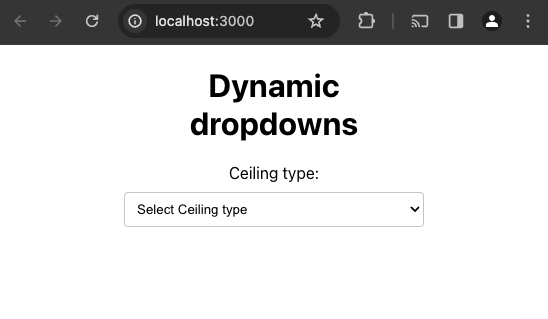
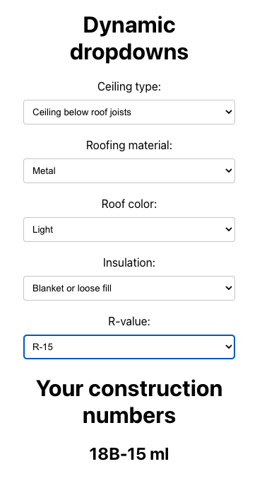

# dynamic forms

## Quick start

Install dependencies

```
yarn 
```

Start the the server

```
yarn server
```

Start the React client

```
yarn client
```

Navigate to the UI at `localhost:3000`

You should see this:



Use the UI to filter down the results. For example:




### Tests

Run the server side test via

```
yarn test
```

## Overview

This is a client/server application which dynamically builds a form and determines the 
Extended Construction Number based on a users selection.

The server side is implemented using Express, where an API endpoint `/api/choices` receives
the currently selected dropdowns via query params. These are used to determine the appropriate 
dropdown column and unique options to return.

The frontend is a React application which makes the API call to the server and allows a user to
interact with the dropdown boxes.

An example sequence to determine the Extended Construction Numbers is demonstrated below via `curl`.

### Example

User selects `Ceiling below roof joists`

```
curl "http://localhost:3001/api/choices?Ceiling%20type=Ceiling%20below%20roof%20joists"
{
    "Roofing material": [
        "Asphalt shingles",
        "Membrane",
        "Metal",
        "Tar and gravel",
        "Tile",
        "Wood shakes"
    ]
}
```

User selects `Metal`

```
curl "http://localhost:3001/api/choices?Ceiling%20type=Ceiling%20below%20roof%20joists&Roofing%20material=Metal"
{"Roof color":["Dark","Light","White"]}
```

User selects `Light`

```
curl "http://localhost:3001/api/choices?Ceiling%20type=Ceiling%20below%20roof%20joists&Roofing%20material=Metal&Roof%20color=Light"
{"Insulation":["None","Blanket or loose fill","Board insulation"]}
```

User selects `Blanket or loose fill`

```
curl "http://localhost:3001/api/choices?Ceiling%20type=Ceiling%20below%20roof%20joists&Roofing%20material=Metal&Roof%20color=Light&Insulation=Blanket%20or%20loose%20fill"
{"R-value":["R-11","R-13","R-15","R-19","R-21","R-30","R-38"]}
```

User selects `R-15`

```
curl "http://localhost:3001/api/choices?Ceiling%20type=Ceiling%20below%20roof%20joists&Roofing%20material=Metal&Roof%20color=Light&Insulation=Blanket%20or%20loose%20fill&R-value=R-15"
{"Extended Construction Numbers":["18B-15 ml"]}
```

The extended construction numbers for this combination of selections are `18B-15 ml`.


### Error handling

Error handling is very basic at this time. Upon an error, the server returns a 400. This will cause the UI to reset.